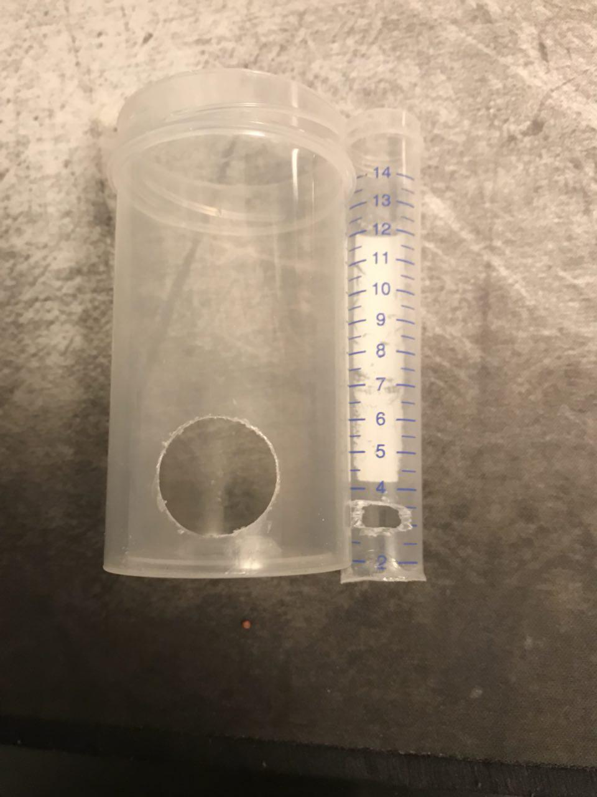
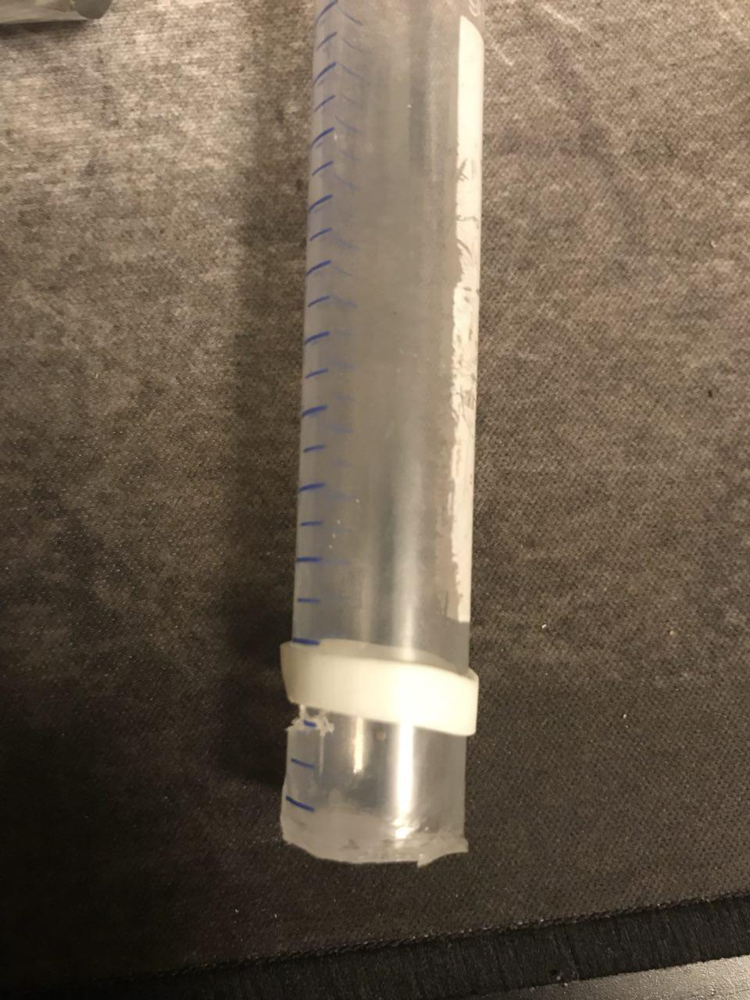
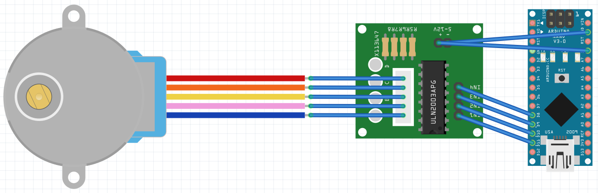

# Comedero automático
Comedero automático para acuario con Arduino nano y un motor paso a paso, el código es lo más sencillo posible, en un futuro se implementará el control de luz del acuario y algunas cosas más.

## Componentes necesarios: 
* Arduino nano V3.0 (4~6€).
* Motor paso a paso *28BYJ-48* + controladora *ULN2003* (4€).
* Probeta (1~2€).
* Pieza impresa en 3d.
* IDE Arduino, se puede descargar desde [aquí](https://www.arduino.cc/en/Main/Software), 

## Pasos:

*Como tuve ciertos problemas con el tornillo sin fin, decidí solucionarlo con el propio recipiente de la comida de los peces, la solución fué sencilla, pegué el recipiente del comedero al tornillo sin fin, así, cada vez que el tornillo da una vuelta hace el efecto de una cuchara cogiendo comida y volcándola cuando la probeta da la vuelta completa.*

1. Al recipiente de la comida para peces le  hacemos un orificio del tamaño de la probeta, y a la probeta le hacemos un pequeño rectángulo (el tamaño tiene que ser igual a la cantidad de comida que queremos que recoja).

*En caso de hacer el orificio de la probeta demasiado grande,podemos ponerle una goma para poder cerrarlo y abrirlo, midiendo así la cantidad que deposita.* 

2. Hacemos las conexiones de la placa Arduino con el motor paso a paso; las conexiones de Arduino con el motor paso a paso son las siguientes:

| **Motor** | **Arduino** |
| :---: | :-----: |
| IN1   |   D11   |
| IN2   |   D10   |
| IN3   |   D9    |
| IN4   |   D8    |
|  -    |   GND   |
|  +    |   5v    |

3. Cargamos el código en Arduino con su IDE, lo podéis encontrar en la carpeta de [arduinoCode](https://github.com/wimel/Comedero-automatico-/blob/master/ArduinoCode/comedero.ino).

4. Conectamos la placa de Arduino a cualquier cargador (con uno de movil es suficiente) y probamos que todo funciona correctamente.

Espero les sirva de ayuda.
